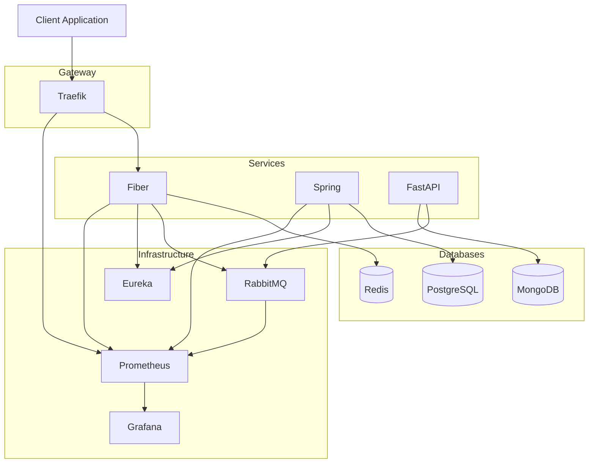

# 🩺 RefuCare

RefuCare is a cross-language, fault-tolerant microservices lab designed for teaching distributed systems through the lens of post-crisis healthcare management. It simulates a resilient medical logistics and diagnostics system using Go, Java, and Python.

